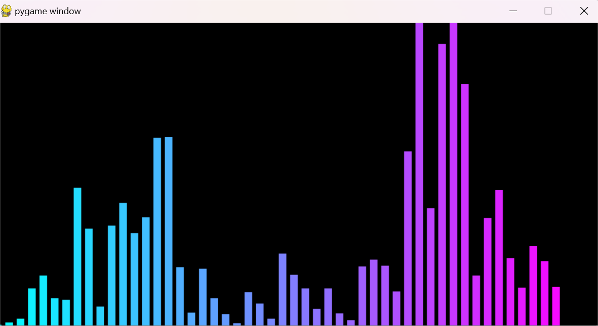

# 🎵 Audio Visualizer

## 📌 Overview
The **Audio Visualizer** is a real-time audio visualization project built using Python. It captures live audio, processes it using Fast Fourier Transform (FFT), and displays a dynamic visual representation of the sound frequencies using Pygame.

## ✨ Features
- 🎙️ **Real-time audio capture** using `sounddevice`
- 📊 **Fourier Transform (FFT)** for frequency analysis
- 🎨 **Dynamic bar visualization** based on frequency magnitude
- 🎧 **Microphone test utility** to ensure audio input is working
- 📦 **Minimal dependencies** for easy setup

## 🛠️ Installation
1. **Clone the repository**:
   ```sh
   git clone https://github.com/isthatlak/Real-Time-Audio-Visualizer.git
   cd Real-Time-Audio-Visualizer
   ```

2. **Create a virtual environment (recommended)**:
   ```sh
   python -m venv venv
   source venv/bin/activate  # macOS/Linux
   venv\Scripts\activate    # Windows
   ```

3. **Install dependencies**:
   ```sh
   pip install -r requirements.txt
   ```

## 🚀 Usage
### **1️⃣ Test Microphone**
Check if your microphone is working properly:
```sh
python test_mic.py
```

### **2️⃣ Capture and Playback Audio**
Record a short audio clip and play it back:
```sh
python audio_capture.py
```

### **3️⃣ Run the Visualizer**
Launch the real-time audio visualizer:
```sh
python visualizer.py
```

## 🖥️ Technologies Used
- **Python** 🐍
- `sounddevice` 🎙️ - Audio input/output
- `numpy` 🔢 - Numerical processing
- `scipy` 📊 - FFT and signal processing
- `pygame` 🎮 - Visualization

## 📷 Screenshot


## 📜 License
This project is licensed under the MIT License.

## 🤝 Contributing
Feel free to submit issues and pull requests to improve this project!

---
🚀 **Developed by Lakshay Bhandari**


